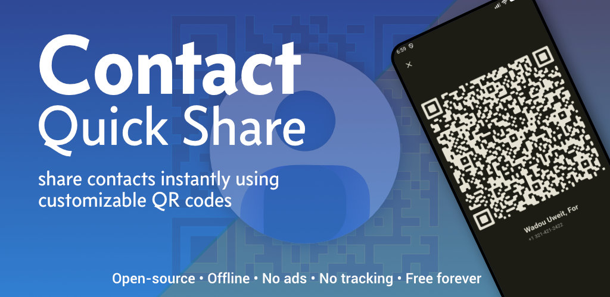

# Contact Quick Share  

<p align="center">
  
</p>

**Share Contacts via QR Code**

A fast, beautiful, privacy-first mobile app to share contacts instantly using customizable QR codes (vCard 3.0).

Open-source • Offline-first • No ads • No tracking • Free forever

[](https://opensource.org/licenses/MPL-2.0)


## About

Contact Quick Share is a lightweight, offline-first app for generating and sharing contact information via customizable QR codes—one or two taps for networking, events, or everyday use. No accounts, no cloud, and no internet required for core functionality.

Release history is documented in [`CHANGELOG.md`](CHANGELOG.md).

## Features

- Instant QR code generation from device contacts or custom business cards
- Beautiful, fully customizable QR codes (colors, logos, eye shapes, gradients)
- Business cards: create, link to contacts (auto-sync option), reorder, edit from QR (tap for menu or swipe right-to-left)
- One- or two-tap sharing experience
- vCard 3.0 contact data (aligned with QR encoding and broad scanner support)
- Local SQLite storage for business cards (on-device)
- Light/dark/system theme
- Export/import your cards & settings

## Screenshots

<p align="center">
  
  
  
</p>

<p align="center">
  
  
  
</p>

## Getting started

### Prerequisites

- [Flutter](https://flutter.dev) (Dart SDK as specified in [`pubspec.yaml`](pubspec.yaml))
- Android Studio / Xcode for on-device testing

### Run locally

```bash
git clone https://github.com/aleclerc/contact-quick-share.git
cd contact-quick-share
flutter pub get
flutter run
```

### Permissions

- **Contacts** (read-only) — list and share contact data you choose

## Tech stack

- Flutter (latest stable)
- flutter_contacts — device contacts & vCard handling
- pretty_qr_code — QR generation
- image_picker — pick images from gallery for QR / card artwork (no in-app camera)
- sqflite — local SQLite storage
- Riverpod — state management
- go_router — navigation
- share_plus — sharing

## Contributing

Contributions are welcome. This project uses the [Mozilla Public License 2.0](LICENSE.md).

1. Fork the repo  
2. Create your feature branch (`git checkout -b feature/amazing-feature`)  
3. Commit your changes (`git commit -m 'Add some amazing feature'`)  
4. Push to the branch (`git push origin feature/amazing-feature`)  
5. Open a Pull Request  

Please read [CONTRIBUTING.md](CONTRIBUTING.md) for setup, style, and PR expectations.

## License

- **Source code** is licensed under the [Mozilla Public License 2.0 (MPL-2.0)](LICENSE.md).
- **Design assets, logos, icons, and store graphics** (in the `design/` folder) are licensed under [CC BY-SA 4.0](design/LICENSE-design.md).

## Branding and Trademarks

"Contact Quick Share" and the associated logos are trademarks of Alexandre Leclerc.

You are welcome to use the licensed design assets in forks and community projects, as long as you follow the CC BY-SA 4.0 terms (including attribution and ShareAlike). However, use of the project name "Contact Quick Share" or the official logos must not suggest official endorsement or cause confusion with the original project. Forks should preferably use a different name to avoid confusing users. Nominative fair use is allowed (e.g., "a fork of Contact Quick Share").

For questions about commercial use of the branding or modified logos, please contact me.

---

Made with ❤️ for fast & private contact sharing.
